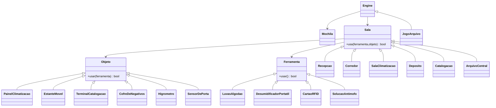

# Adventure POO — Arquivo da Produtora (VERSÃO ATUALIZADA)
Este pacote atende aos critérios da disciplina com **6+ salas**, **6+ objetos**, **4 ferramentas**, diagrama de classes e execução via **Node.js** usando as **classes básicas do professor**.

> **Importante:** Coloque o arquivo **`Basicas.js`** do professor nesta mesma pasta (não altere esse arquivo).

## ✅ Critérios atendidos
- **Critério 1 — Diagrama**: diagrama Mermaid com **básicas** e **derivadas** (abaixo).
- **Critério 2 — História original + contagem**: 6 salas, 6+ objetos, 4 ferramentas; fluxo exige **≥ 4 salas, 3 objetos, 2 ferramentas** (na prática usa mais).
- **Critério 3 — OO + exemplo funcional**: classes derivadas de `Ferramenta`, `Objeto`, `Sala`, `Engine`; roda sem erros com `node index.js`.
- **Critério 4 — Organização/comentários**: arquivos separados e comentados.

## 🎭 História (resumo)
Você é arquivista de uma produtora. A **climatização** falhou, há risco aos **negativos raros**. Use **EPI**, **desumidificador**, **cartão** e **antimofo**, autentique no **terminal**, libere a **estante móvel**, **meça a umidade** com **higrômetro** e estabilize o **cofre**.

## 🗺️ Salas
- **Recepcao** — início; EPI `luvas`
- **Corredor** — agora com **`higrometro`** (objeto)
- **SalaClimatizacao** — `painel_climatizacao`
- **Deposito** — ferramenta `desumidificador`
- **Catalogacao** — ferramenta `cartao` + `terminal_catalogacao`
- **ArquivoCentral** — `estante_movel`, `cofre_negativos`, ferramenta `antimofo`, e **`sensor_porta`** (novo objeto)

## 🔧 Ferramentas
- `luvas` (EPI) — marca estado `usaLuvas = true`
- `desumidificador` — 2 usos
- `cartao` — 3 cargas
- `antimofo` — 1 uso

## 🧩 Objetos (principais)
- `painel_climatizacao` — liga clima com `desumidificador`
- `terminal_catalogacao` — exige `luvas` + `cartao` (autentica)
- `estante_movel` — abre com `cartao` **após** terminal ok
- `cofre_negativos` — vitória se `luvas` + `climaLigado` + `terminalOK` + **`higrometroOK`** + `antimofo`
- **Novos**: `higrometro` (usa `luvas`) e `sensor_porta` (usa `cartao`, opcional)

## ▶️ Como rodar
```bash
npm init -y
npm i bycontract prompt-sync
# garanta que Basicas.js (do professor) está nesta pasta
node index.js
```

## 🧪 Caminho de vitória (exemplo)
```
pega luvas
sai Corredor
usa luvas higrometro          # registra higrometroOK
sai Deposito
pega desumidificador
sai SalaClimatizacao
usa desumidificador painel_climatizacao
sai Catalogacao
pega cartao
usa cartao terminal_catalogacao
sai ArquivoCentral
usa cartao estante_movel
pega antimofo
usa antimofo cofre_negativos  # vitória: requer luvas+clima+terminal+higrometro
```

## 📐 Diagrama de classes (Mermaid)

