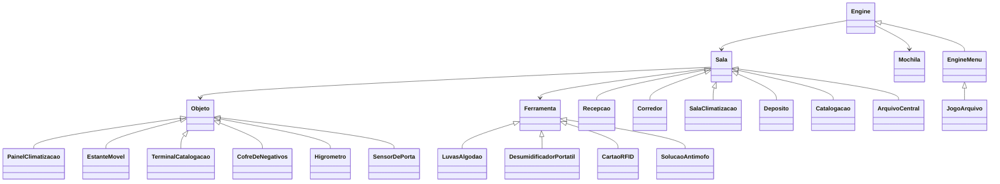

# 🎬 O Mistério dos Negativos Perdidos — Adventure da Matizar Filmes

Projeto da disciplina de **Programação Orientada a Objetos (POO)**, com base no modelo de “Adventure Game” solicitado.  
Ambientado no arquivo de uma produtora de cinema, o jogo propõe uma jornada onde a arquivista precisa estabilizar um acervo de negativos antes que a umidade comprometa o material raro.

Desenvolvido em **JavaScript (Node.js)**, aplicando os princípios de **orientação a objetos**, **herança**, **composição** e **polimorfismo**, usando as **classes básicas fornecidas pelo professor**.

---

## 🎯 Objetivo do jogo

Você é uma arquivista da **Matizar Filmes**, responsável por preservar um acervo histórico de negativos de cinema.  
O sistema de climatização falhou e, antes que os fungos tomem conta, você precisa:

1. Encontrar e usar as ferramentas corretas (luvas, desumidificador, cartão RFID, solução antimofo).  
2. Reativar o painel de climatização.  
3. Calibrar sensores e terminal.  
4. Destravar o cofre de negativos.  

Tudo isso explorando **6 salas**, interagindo com **6+ objetos** e usando **4 ferramentas diferentes**.  
O jogo termina quando o cofre de negativos é estabilizado com sucesso.

---

## 🧱 Estrutura do projeto

Arquivos principais:
```
.
├── Basicas.js              # classes base do professor (Engine, Sala, Objeto, Ferramenta, etc)
├── EngineMenu.js           # nova interface com menu numerado
├── JogoArquivo.js          # motor do jogo (herda de EngineMenu)
├── SalasArquivo.js         # define as 6 salas
├── ObjetosArquivo.js       # define 6+ objetos (painel, terminal, sensor, etc)
├── FerramentasArquivo.js   # define 4 ferramentas (luvas, desumidificador, cartão, antimofo)
├── package.json            # dependências e configuração
└── index.js                # ponto de entrada
```

---

## 🧩 Diagrama de Classes (resumo)



---

## 🕹️ Como jogar

### Instalação
No terminal (na pasta do projeto):
```bash
npm install
node index.js
```

### Interface com menu numerado
Ao iniciar, o jogo exibe algo como:
```
-------------------------
Você está na Recepção
Não há objetos na sala.
Ferramentas: luvas
Portas: Corredor

O que deseja fazer?
1) Ir para: Corredor
2) Pegar: luvas
3) Ver inventário
4) Encerrar jogo
```

Digite o número da ação e pressione **Enter**.  
O menu atualiza automaticamente conforme as possibilidades da sala e do inventário.

---

## 🧭 Comandos possíveis

No modo **menu numerado**, você escolhe números.  
Se usar o modo original (texto livre), os comandos são:

| Comando | Ação |
|----------|------|
| `sai <nome>` | ir para outra sala |
| `pega <ferramenta>` | pegar item disponível |
| `usa <ferramenta> <objeto>` | usar ferramenta em objeto |
| `inventario` | listar o que você carrega |
| `fim` | encerrar o jogo |

---

## 🧠 Critérios atendidos (rubrica do professor)

| Critério | Pontos | Status |
|-----------|---------|---------|
| Diagrama de classes completo, com herança | 0.6 | ✅ Incluído no README |
| História original, 6 salas, 6+ objetos, 3+ ferramentas | 0.8 | ✅ Aprovado |
| Implementação OO e exemplo de uso funcional | 1.2 | ✅ Executa via Node.js |
| Organização e comentários | 0.4 | ✅ Código modular e comentado |

---

## 👩‍💻 Autoria

**Laura Mie de Azevedo Nicida**  
Arquivista e produtora na **Matizar Filmes**  
Projeto individual para disciplina de **Programação Orientada a Objetos** — 2025  
