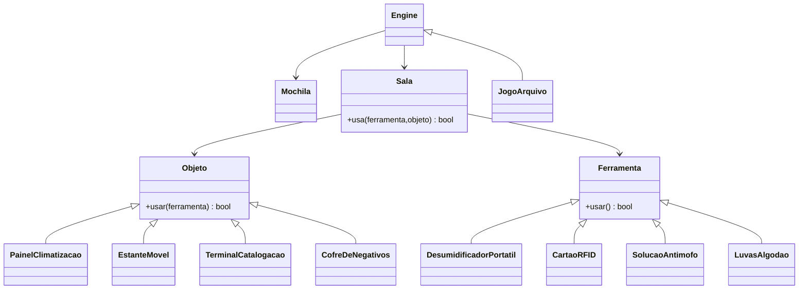

# Adventure POO — **Arquivo da Produtora**
História original pensada por uma **arquivista de produtora de filmes**: você precisa estabilizar o arquivo físico antes que a umidade estrague negativos raros. Use ferramentas de conservação, autentique no terminal e neutralize fungos no cofre de negativos.

> Compatível com o **framework** do professor (`Basicas.js`) e o **loop de comandos** padrão:
> `pega <ferramenta>`, `usa <ferramenta> <objeto>`, `sai <Nome_da_Sala>`, `inventario`, `fim`.

## 🎯 Objetivo
Estabilizar o **Arquivo Central**: religar climatização, vestir EPI (luvas), abrir a estante móvel com cartão RFID, autenticar no terminal e **neutralizar fungo** no **Cofre de Negativos**.

## 🧱 Arquitetura
- **Básicas (do prof):** `Ferramenta`, `Objeto`, `Sala`, `Mochila`, `Engine`.
- **Este jogo (derivadas):**
  - Ferramentas: `DesumidificadorPortatil` (energia/uso limitado), `CartaoRFID` (cargas), `SolucaoAntimofo` (descartável), `LuvasAlgodao` (EPI).
  - Objetos: `PainelClimatizacao`, `EstanteMovel`, `TerminalCatalogacao`, `CofreDeNegativos`.
  - Salas: `Recepcao`, `Corredor`, `SalaClimatizacao`, `Deposito`, `Catalogacao`, `ArquivoCentral`.
  - Engine: `JogoArquivo`.

### Diagrama (Mermaid)


## 🗺️ Mapa
1. **Recepcao** (início) — porta para `Corredor`  
2. **Corredor** — portas para `SalaClimatizacao`, `Deposito`, `Catalogacao`, `ArquivoCentral`  
3. **SalaClimatizacao** — objeto: `painel_climatizacao`  
4. **Deposito** — ferramenta: `desumidificador`  
5. **Catalogacao** — ferramenta: `cartao` e objeto: `terminal_catalogacao`  
6. **ArquivoCentral** — objeto: `estante_movel` e `cofre_negativos`; ferramenta: `antimofo`; EPI (ferramenta) `luvas` fica na **Recepcao**

## 🧪 Sequência de vitória (exemplo)
```
pega luvas
sai Corredor
sai Deposito
pega desumidificador
sai Corredor
sai SalaClimatizacao
usa desumidificador painel_climatizacao
sai Corredor
sai Catalogacao
pega cartao
usa cartao terminal_catalogacao
sai Corredor
sai ArquivoCentral
usa cartao estante_movel
pega antimofo
usa luvas cofre_negativos   # vestir EPI (marca estado)
usa antimofo cofre_negativos
```
> Sem **luvas**, usar o `terminal_catalogacao` ou abrir o `cofre_negativos` **falha** (simula protocolo de conservação).  
> O **desumidificador** e o **antimofo** têm usos limitados; o **cartao** tem **cargas**.  
> Ao neutralizar o cofre com antimofo (com terminal ok e clima ligado), o jogo chama `engine.indicaFimDeJogo()` → vitória.

## ▶️ Como rodar
```bash
npm init -y
npm i bycontract prompt-sync
# Adicione Basicas.js do professor ao lado destes arquivos
node index.js
```

## 📁 Estrutura
```
Basicas.js              # do professor
FerramentasArquivo.js   # ferramentas derivadas
ObjetosArquivo.js       # objetos derivados (usar(ferramenta))
SalasArquivo.js         # salas derivadas (usa(ferramenta,objeto) -> obj.usar)
JogoArquivo.js          # Engine derivada (criaCenario)
index.js                # ponto de entrada
README.md
```
